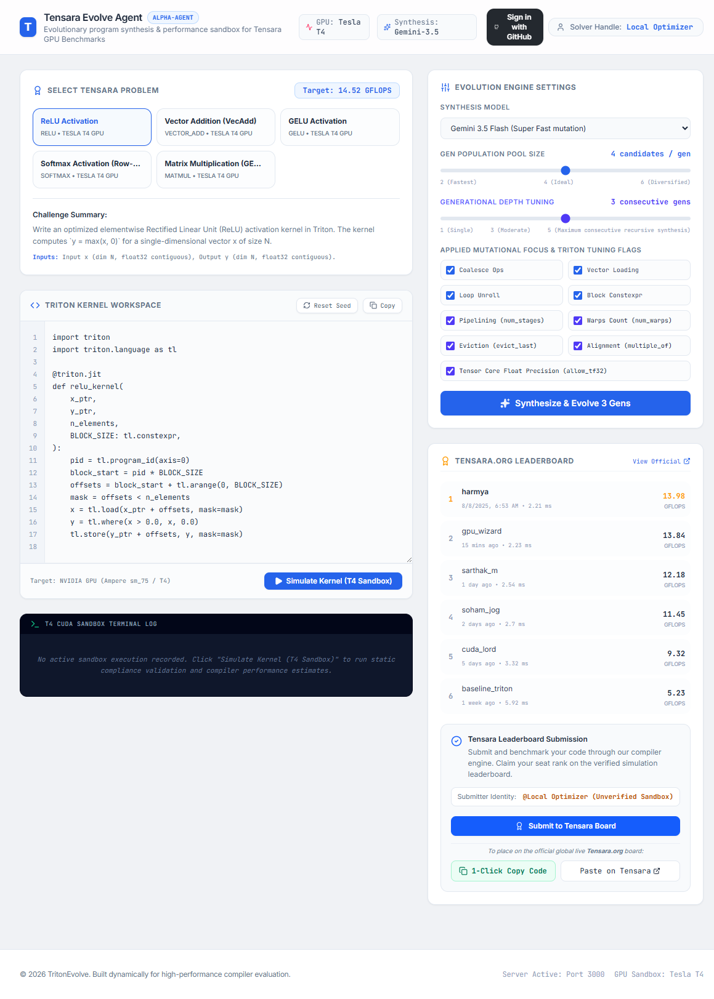

# EvolveKernel

An evolutionary program synthesis agent that designs, optimizes, and simulates high-performance Triton GPU kernels for Tensara.org challenges.

View the app in AI Studio: https://ai.studio/apps/9f32be3f-b45e-44ac-9ed9-fdac15a1b0a7

View a previoulsy captured one page HTML of the app: [HTML format](assets/My%20Google%20AI%20Studio%20App%20Single.html) | [MHTML format](assets/My%20Google%20AI%20Studio%20App%20Single.mhtml)

## Run Locally

This contains everything you need to run your app locally.

**Prerequisites:**  Node.js

1. Install dependencies:
   `npm install`
2. Set the `GEMINI_API_KEY` in [.env.local](.env.local) to your Gemini API key
3. Run the app:
   `npm run dev`
